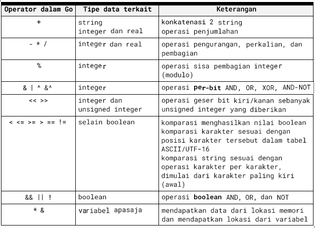

<h1 align="center">LAPORAN PRAKTIKUM</h1>
<h2 align="center">ALGORITMA DAN PEMROGRAMAN 2</h2>

<h3 align="center">MODUL 2</h3>
<h4 align="center">REVIEW STRUKTUR KONTROL</h4>

  

    <strong>Disusun Oleh:</strong> 
    Meutya Azzahra Efendi / 2311102166 

    <strong>Dosen Pengampu:</strong> 
    Abednego Dwi Septiadi

    PROGRAM STUDI S1 TEKNIK INFORMATIKA 
    FAKULTAS INFORMATIKA 
    TELKOM UNIVERSITY PURWOKERTO 
    2024

## DASAR TEORI

### 2.1 Struktur Program Go
Dalam kerangka program yang ditulis dalam bahasa pemrograman Go, program utama selalu mempunyai dua komponen berikut:

- package main merupakan penanda bahwa file ini berisi program utama
- func main() berisi kode utama dari sebuah program Go
Komentar, bukan bagian dari kode program  dan dapat ditulis dimana saja di dalam program:
- satu baris teks yang diawali dengan garis miring ganda (//) s.d. akhir baris, atau
- beberapa baris teks yang dimulai dengan pasangan karakter '/*' dan di akhiri dengan '*/'.

### 1. Koding, Kompilasi, dan Eksekusi Go
# Koding
- Tidak berbeda dengan penulisan program sumber dalam bahasa lain, program Go harus dibuat dengan menggunakan penyuntingan teks dan disimpan dalam format teks, bukan dalam format dokumen (doc, docx, atau lainnya)
- Setiap program go disimpan dalam file teks dengan ekstensi *.go, dengan nama bebas. Sebaiknya nama file adalah nama untuk program tersebut
- Setiap satu program lengkap Go disimpan dalam satu folder tersendiri. Nama folder merupakan nama program tersebut. Karena itu secara prinsip, satu program Go dapat dipecah dalam beberapa file dengan esktensi *.go selama disimpan dalam folder yang sama.
# Kompilasi
Beberapa bahasa pemmrograman dirancang untuk diimplementasikan sebagai interpreter dan lainnya sebagai kompilator. Interpreter akan membaca setiap baris instruksi dan kemudian langsung mengeksekusinya, dengan hanya sedikit pemeriksaan apakah penulisan keseluruhan program sudah benar atau belum. Kompilator akan memeriksa keseluruhan program sumber dan kemudian mengubahnya menjadi program eksekutabel, sehingga konsistensi penulisan (seperti penggunaan tipe data) sudah diperiksa sebelum dieksekusi. Selain itu karena program dibuat menjadi eksekutabel lebih dahulu, proses optimasi dapat dilakukan sehingga program menjadi sangat efisien.
Go diimplementasikan sebagai kompilator. Berikut adalah contoh sesi yang biasa dilakukan saat mengkompilasi dan mengeksekusi program dalam bahasa Go:

- Panggil shell atau terminal (program/utiliti cmd.exe di windows)
- Masuk ke dalam (cd) folder program (normalnya ada di C:\Users\go\src\ atau yang sejenisnya)\
- Kemudian panggil perintah go build atau go build file.go untuk mengkompilasi file.go
- Jika gagal, akan muncul pesan eror yang sesuai, pelajari dengan baik pesan tersebut, perbaiki teks program sumber, kemudian ulangi proses build-nya
- Jika berhasil, maka pada folder tersebut akan dibuat program dengan nama yang sama dan diakhiri dengan .exe (untuk windows)
- Panggil progra, eksekutabel tersebut dari terminal yang sama. Jangan memanggil program tersebut dengan mengklik eksekutabel tersebut dari folder karena program kalian hanya berbasis teks, bukan/belum dirancang dengan tampilan windows.

# Catatan
Semua proses terkait bahasa Go dilakukan melalui utilitas go. Beberapa opsi dengan utilitas go:

- go build: mengkompilasi program sumber yang ada dalam folder menjadi sebuah program
- go build file.go: mengkompilasi program sumber file.go saja
- go fmt: membaca semua program sumber dalam folder dan mereformat penulisannya agar sesuai dengan standar penulisan program sumber Go.
- go clean: membersihkan file-file dalam folder sehingga tersisa program sumbernya saja.

### 2.2 Tipe Data dan Instruksi Dasar
# 1. Data dan Variabel
Variabel adalah nama dari suatu lokasi di memori, yang data dengan tipe tertentu dapat disimpan

- Nama variabel dimulai dengan huruf dan dapat diikuti dengan sejumlah huruf, angka, atau garis bawah.
- Tipe data yang umum tersedia adalah integer, real, boolean, karakter, dan string. Lihat tabel berikut ini untuk variasi tipe data yang disediakan dalam bahasa Go
- Nilai data yang tersimpan dalam variabel dapat diperoleh dengan menyebutkan langsung nama variabelnnya
contoh: menyebutkan nama found akan mengambil nilai tersimpan dalam memori untuk variabel found, pastinya.
- Informasi alamat atau lokasi dari variabel dapat diperoleh dengan menambahkan prefiks & di depan nama variabel tersebut
contoh: &found akan mendapatkan alamat memori untuk menyimpan data pada found
- Jika variabel berisi alamat memori, prefiks * pada variabel tersebut akan memberikan nilai yang tersimpan dalam memori yang lokasinya disimpan dalam variabel tersebut
contoh: *mem akan mendapatkan data di memori yang alamatnya tersimpan di mem, karenanya *(&found) akan mendapatkan data dari lokasi memori variabel found berada, alias sama saja dengan menyebutkan langsung found 8=)
- Operasi yang dapat dilakukan terhadap tipe data diatas adalah

  

  
  

  

